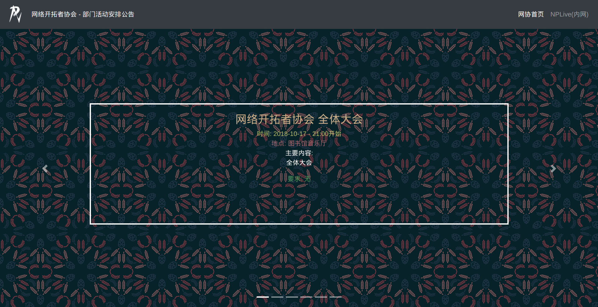

# Timeline-bitnp

一个bootstrap 和 vue 作为前端, mariadb 与 php\go 作为后端 驱动的网站.
展示五个部门未来最近一次的活动计划, 包括时间\地点\主要内容\其他要求等.
同时可以在侧边栏展示大家的博客



## 目前的计划

- [x] bootstrap4 简单的活动计划展示
  - [x] 各部门介绍
- [x] Vue 作为前端框架,来解耦
  - [ ] 定义接口数据格式

## docker command
```bash
docker build -t "bitnp-timeline" .
docker run -d --name timeline bitnp-timeline
```
or
```bash
docker run -d -p 10010:80 --name timeline -v "$PWD"/frontend:/var/www/html php:7.2-apache
```